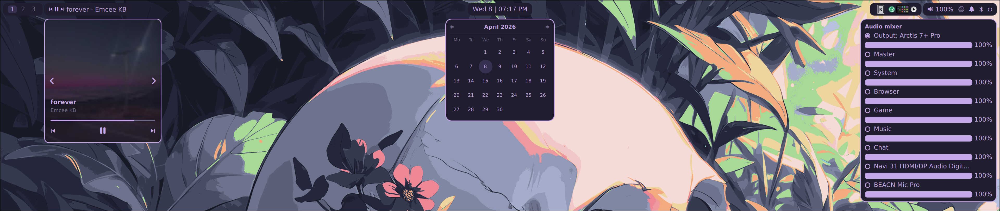

# bar207



*A sleek, Wayland-native status bar built with Quickshell.*

**bar207** is a status bar powered by [Quickshell](https://git.outfoxxed.me/outfoxxed/quickshell). It tightly integrates with Hyprland, PipeWire, NetworkManager, BlueZ, and MPRIS to provide a seamless desktop experience.

> **Note:** This project was developed with the assistance of AI models, specifically Claude and Gemini. 

## ✨ Features

* **Hyprland Workspaces:** Interactive workspace indicators.
* **Media Player:** MPRIS integration with album art extraction and playback controls.
* **System Tray:** Full standard system tray support.
* **Audio Mixer:** PipeWire integration to control sink volumes and switch outputs.
* **Network & Bluetooth:** Native Quickshell toggles, scanning, and connection menus.
* **Toast Notifications:** Custom daemon with inline replies and action buttons.
* **Power Menu:** Full screen, animated overlay for session management.

---

## 🎨 Customization & Theming

This bar is designed with a specific, hardcoded layout (padding, widgets, order). To change the structure, you will need to directly edit the `.qml` files. 

However, **colors are fully customizable natively through Nix.**

In your NixOS configuration, you can override the default color palette (Rosé Pine) by passing hex codes directly to the module. Here is an example using Catppuccin Mocha:

```nix
programs.bar207 = {
  enable = true;
  colors = {
    background = "#1e1e2e";
    selection  = "#313244";
    foreground = "#cba6f7";
    inactive   = "#6c7086";
  };
};
```

---

## 🚀 Getting Started

### Try it out (Without Installing)
If you have the Nix package manager installed, you can test bar207 directly from this repository without permanently installing anything on your system.

**Run directly from GitHub:**
```bash
nix run github:Life-Not-Found/bar207
```

**Run from a local clone:**
```bash
git clone [https://github.com/Life-Not-Found/bar207.git](https://github.com/Life-Not-Found/bar207.git)
cd bar207
nix run .
```
*(Note: If you are modifying the code locally, remember that Nix flakes only see files tracked by Git. Run `git add .` after creating new files before running!)*

### Installation: NixOS
Because bar207 needs to talk to your user-level D-Bus, PipeWire, and Wayland session, it must be run as a **systemd user service**. This repository provides a NixOS module that handles this wiring automatically.

1. **Add the input to your system's `flake.nix`:**
   ```nix
   inputs = {
     nixpkgs.url = "github:nixos/nixpkgs/nixos-unstable";
     bar207.url = "github:Life-Not-Found/bar207";
   };
   ```

2. **Import the module:**
   Pass the module into your system configuration's imports list.
   ```nix
   outputs = { self, nixpkgs, bar207, ... }@inputs: {
     nixosConfigurations."yourHostname" = nixpkgs.lib.nixosSystem {
       system = "x86_64-linux";
       specialArgs = { inherit inputs; };
       modules = [
         ./configuration.nix
         bar207.nixosModules.default
       ];
     };
   };
   ```

3. **Enable the program:**
   In your `configuration.nix` (or wherever you define your system packages), enable it:
   ```nix
   programs.bar207.enable = true;
   ```

4. **Rebuild your system** (`sudo nixos-rebuild switch --flake .#yourHostname`). The bar will now automatically start when you log into your graphical Wayland session.

### Installation: Standard Linux Distros
If you are on Arch, Debian, Fedora, or another standard distribution, you can run this bar without Nix.

1. **Install Dependencies:**
   Ensure you have the following installed on your system:
   * `quickshell` *(You may need to build this from source depending on your distro)*
   * `networkmanager` *(Specifically `nmcli` for the network widget)*
   * `bluez` *(For Bluetooth)*
   * `pipewire` *(For audio)*
   * A **Nerd Font** *(Highly recommended, as the UI relies on these for icons)*

2. **Clone the repository:**
   ```bash
   git clone [https://github.com/Life-Not-Found/bar207.git](https://github.com/Life-Not-Found/bar207.git) ~/.config/bar207
   ```

3. **Test the bar:**
   ```bash
   quickshell -p ~/.config/bar207/shell.qml
   ```

4. **Autostart with Hyprland:**
   To make the bar start automatically when you log in, add this line to your `~/.config/hypr/hyprland.conf`:
   ```text
   exec-once = quickshell -p ~/.config/bar207/shell.qml
   ```

---

## 🛠️ Troubleshooting

* **Bar isn't showing up on login? (NixOS)**
  Check the systemd user logs to see if Quickshell is throwing a QML error:
  ```bash
  systemctl --user status bar207.service
  journalctl --user -xeu bar207.service
  ```

* **Icons are showing as weird boxes?**
  Make sure you have a **Nerd Font** installed and set as your system default. The QML files hardcode these icons, so a proper font is strictly required to render them correctly.